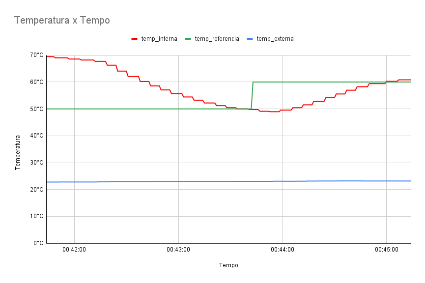
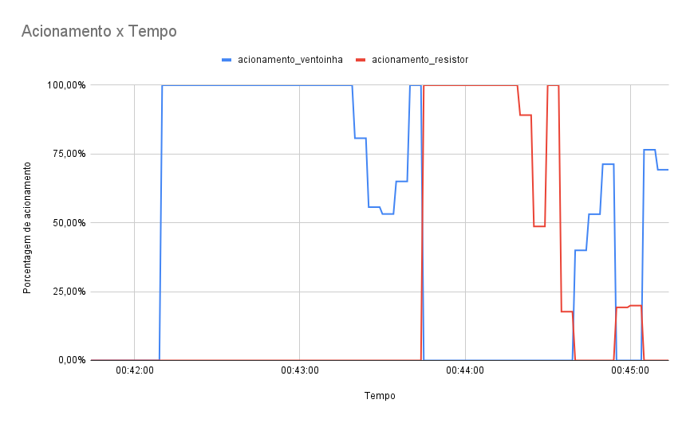

# Trabalho 2 - Forno

## 1. Instalação e Utilização

1. Execute `pip install -r requirements.txt` para instalar as dependências.
2. Execute `python3 main.py` para rodar o programa
3. O menu possui 2 opções, alterar os valores do pid (kp, ki, e kd), e informar uma temperatura de referência para ser usada no modo debug. As interações principais devem ser feitas pelo dashboard.

## 2. Experimento - Temperatura fixa
Esse experimento iniciou com a placa na temperatura de 69.44 ºC e acompanhou sua descida até 48.94 ºC, onde subiu até chegar em 60.81 ºC.

### 2.1 Temperaturas
 

### 2.2 Acionamento da ventoinha/resistor
 
