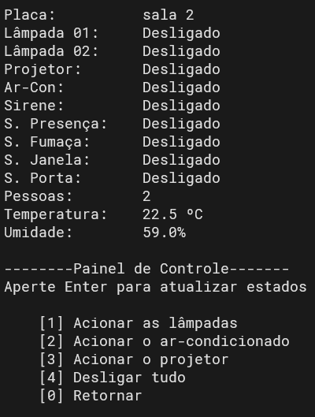
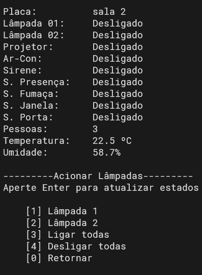

# Trabalho 1 - Automação predial

## 1. Instalação

1. Coloque os conteúdos da pasta `central/` na placa que servirá como servidor central.  
2. Coloque os conteúdos da pasta `distrib/` nas placas que servirão como servidores distribuídos.
3. Nos servidores distribuidos, execute `pip install -r requirements.txt` para instalar as dependências.
4. No servidor central, execute `python3 central.py <host> <port>` substituindo `<host>` e `<port>` pelo ip e porta da placa, respectivamente.
5. Nos servidores distribuídos, execute `python3 control.py <config.json>` substituindo `<config.json>` pelo seu arquivo com a configuração da placa (alguns foram disponibilizados como exemplo).

## 2. Telas
### 2.1 Console principal
 

### 2.2 Console da sala
 

### 2.3 Console de lâmpadas
 

